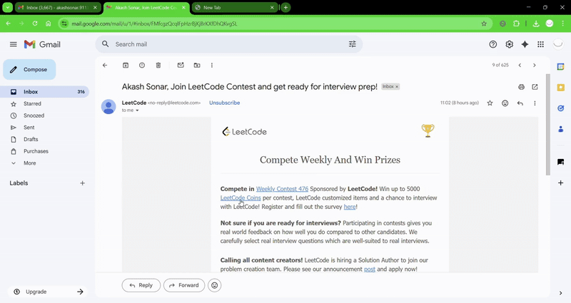

# Gmail Summarizer Add-on

This is a demo Google Workspace Add-on built for an internship assignment.

The add-on activates when a user opens an email, reads the email's content, and uses the Google Gemini API to generate a one or two-sentence summary, which is then displayed in the Gmail sidebar.

### Features
* **Contextual Trigger:** Runs automatically when any email is opened.
* **AI Summarization:** Uses Google's Gemini API to summarize email content.
* **Secure API Handling:** Uses `PropertiesService` to store the API key securely, not in the code.
* **Robust UI:** Includes a "Retry" button to handle API errors (like "model overloaded") gracefully.

### How to Test
1. **Create Google Gloud account:** Before getting started create an account on google cloud and create a new project as
it is required to test the addon, for more detail on how to set up the environment plz read [this](https://developers.google.com/workspace/add-ons/quickstart/cats-quickstart) article.
2.  **Create an Apps Script Project:** Go to [script.google.com](https://script.google.com) and create a new project.
3.  **Copy Files:**
    * Copy the contents of `Code.gs` from this repository into the `Code.gs` file in your Apps Script project.
    * Enable the "Show 'appsscript.json' manifest file in editor" in Project Settings ⚙️.
    * Copy the contents of `appsscript.json` from this repository into your `appsscript.json` file.
4.  **Get a Gemini API Key:** Create a free API key at [Google AI Studio](https://aistudio.google.com/app/apikey).
5.  **Store the API Key:**
    * In your `Code.gs` file, paste your new API key into the `storeGeminiApiKey` function.
    * From the function dropdown, select `storeGeminiApiKey` and click **Run**.
    * Authorize the script when prompted.
    * **Important:** Delete your key from the code after it runs successfully.
6.  **Install the Add-on:**
    * Click **Deploy > Test deployments**.
    * Click **Install**.
7.  **Run in Gmail:**
    * Open your Gmail and do a hard refresh (Ctrl+Shift+R).
    * Open any email and click the add-on icon in the right-hand sidebar.
    * Authorize the add-on when prompted (you may need to click "Advanced" > "Go to...").
    * The summary will appear in the sidebar.